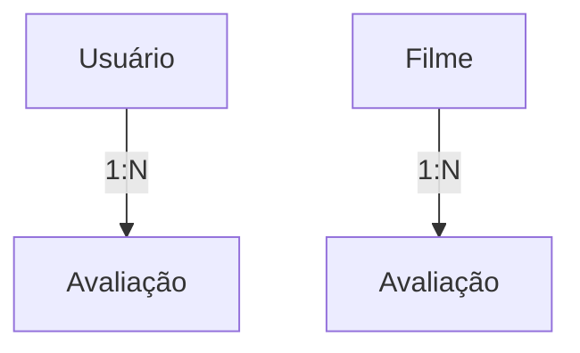

# 📱 API BetterBoxd


## 🚀 Visão Geral

A API do BetterBoxd é uma plataforma voltada para avaliação de filmes, inspirada no Letterboxd, oferecendo funcionalidades para registrar usuários, avaliar filmes, e interagir com a comunidade.

Construída com ASP.NET Core e C# 12, a aplicação possui uma arquitetura limpa, utilizando o Entity Framework Core para acesso a dados, seguindo os princípios SOLID de desenvolvimento e oferecendo uma documentação clara via Swagger.

## 🛠️ Tecnologias Utilizadas

- ASP.NET Core 3.1
- .NET 8
- C# 12
- Entity Framework Core
- SQL Server
- Swagger/OpenAPI
- FluentValidation

## ⚙️ Pré-requisitos

- Visual Studio 2022
- .NET SDK 8.0
- SQL Server
- Git

## 🔄 Fluxo de Funcionamento

O sistema segue uma lógica específica para o relacionamento entre entidades:



### 🎬 Fluxo de Criação de Avaliação

1. **Usuários** e **Filmes** são cadastrados separadamente por meio de suas respectivas rotas.

2. Para registrar uma **Avaliação**:
   - Envie uma requisição POST /api/avaliacoes informando o ID do usuário, o ID do filme, a nota atribuída, o comentário e a data da avaliação.
   - O sistema retorna um JSON com os dados da avaliação criada e o status HTTP `200 OK`.

3. **Filmes** são inicialmente cadastrados com uma **nota média igual a 0**. Essa nota é atualizada automaticamente com base nas avaliações associadas ao filme — seja na criação, edição ou exclusão de uma avaliação.

Esse fluxo garante que as informações sobre os filmes estejam sempre atualizadas de forma dinâmica, refletindo com precisão a média das avaliações feitas pelos usuários.

## 📚 Documentação da API
Acesse a documentação completa da API através do Swagger: `https://localhost:7102/swagger/`

### 📋 Endpoints Disponíveis

#### 👤 Usuários
| Método | Endpoint                | Descrição                                                   |
|--------|-------------------------|-------------------------------------------------------------|
| GET    | `/api/v1/users`          | Lista todos os usuários cadastrados                         |
| GET    | `/api/v1/users/{id}`     | Obtém um usuário específico pelo ID                          |
| POST   | `/api/v1/users`          | Cadastra um novo usuário                                    |
| PUT    | `/api/v1/users/{id}`     | Edita um usuário existente pelo ID                          |
| DELETE | `/api/v1/users/{id}`     | Remove um usuário pelo ID                                   |

#### 🎬 Filmes
| Método | Endpoint                | Descrição                                                   |
|--------|-------------------------|-------------------------------------------------------------|
| GET    | `/api/v1/filmes`          | Lista todos os filmes cadastrados                         |
| GET    | `/api/v1/filmes/{id}`     | Obtém um filme específico pelo ID                          |
| GET    | `/api/v1/filmes/diretor/{diretor}`     | Obtém uma lista de filmes pelo nome do diretor |
| GET    | `/api/v1/filmes/genero/{genero}`     | Obtém uma lista de filmes pelo nome do gênero  |
| GET    | `/api/v1/filmes/ano/{ano}`     | Obtém uma lista de filmes pelo ano de lançamento |
| POST   | `/api/v1/filmes`          | Cadastra um novo filme                                    |
| PUT    | `/api/v1/filmes/{id}`     | Edita um filme existente pelo ID                          |
| DELETE | `/api/v1/filmes/{id}`     | Remove um filme pelo ID                                   |

#### ⭐ Avaliações
| Método | Endpoint                | Descrição                                                   |
|--------|-------------------------|-------------------------------------------------------------|
| GET    | `/api/v1/avaliacoes`          | Lista todas as avaliações cadastradas                      |
| GET    | `/api/v1/avaliacoes/{id}`     | Obtém uma avaliação específica pelo ID                      |
| GET    | `/api/v1/avaliacoes/users/{idUser}`     | Lista todas as avaliações de um usuário específico |
| POST   | `/api/v1/avaliacoes`          | Cadastra uma nova avaliação                                |
| PUT    | `/api/v1/avaliacoes/{id}`     | Edita uma avaliação existente pelo ID                      |
| DELETE | `/api/v1/avaliacoes/{id}`     | Remove uma avaliação pelo ID                               |

### ⚠️ Possíveis Códigos de Resposta

- **200 OK**: Operação realizada com sucesso.
- **400 Bad Request**: Erro de validação de dados.
- **404 Not Found**: Recurso não encontrado (usuário, filme, avaliação, etc.).
- **500 Internal Server Error**: Erro no servidor.

## 🧠 Desafios Enfrentados

Durante o desenvolvimento da API **BetterBoxd**, enfrentei e superei diversos desafios que contribuíram significativamente para meu aprendizado e amadurecimento como desenvolvedor:

- **Implementação de Arquitetura Limpa**  
  Adotar a Clean Architecture exigiu um entendimento aprofundado sobre separação de responsabilidades, organização em camadas e a importância de manter a independência entre domínio, aplicação e infraestrutura.

- **Aplicação dos Princípios SOLID**  
  Incorporar os princípios SOLID na estrutura do projeto foi desafiador, mas essencial para garantir a manutenibilidade, legibilidade e escalabilidade do código.

- **Criação e Uso de Repositórios**  
  Trabalhar com o padrão Repository ajudou a desacoplar a lógica de acesso a dados, mas exigiu cuidado para manter a flexibilidade e evitar redundâncias.

- **Manipulação Avançada com Entity Framework Core**  
  Dominar o EF Core para realizar mapeamentos, configurar relacionamentos e controlar o ciclo de vida das entidades foi crucial para garantir o bom funcionamento da persistência de dados.

- **Documentação da API com Swagger e XML**  
  Garantir uma documentação clara e atualizada foi um desafio importante, principalmente ao integrar comentários XML para descrever corretamente os modelos e endpoints da API.

- **Tratamento Robusto de Exceções**  
  Construir um sistema consistente de tratamento de erros e retornar respostas HTTP apropriadas ajudou a melhorar a experiência do usuário e a confiabilidade da API.


## 💻 Instalação

```bash
# Clone o repositório
git clone https://github.com/VictorBrasileiroo/Projeto_API_Betterboxd.git

# Entre na pasta do projeto
cd Betterboxd.sln

# Restaure os pacotes
dotnet restore

# Atualize o banco de dados com as migrations
dotnet ef database update

#Instale os pacotes do Entity Framework e FluentValidation
```

## 📂 Estrutura do Projeto

```
├── Betterboxd.sln/                        # Solução principal da aplicação
│
├── Betterboxd.API/                        # Projeto principal da API (.NET Web API)
│   ├── Controllers/                       # Controladores com os endpoints da API
│   ├── appsettings.json                   # Configurações da aplicação
│   ├── Program.cs                         # Ponto de entrada da aplicação
│   └── Betterboxd.API.http                # Arquivo para testes de requisições HTTP (VS)
│
├── Betterboxd.App/                        # Camada de aplicação (regras de negócio)
│   ├── Dtos/                              # Objetos de Transferência de Dados
│   ├── Interfaces/                        # Interfaces dos serviços de aplicação
│   ├── Services/                          # Implementações dos serviços de aplicação
│   └── Validations/                       # Classes de validação (FluentValidation, etc.)
│
├── Betterboxd.Core/                       # Camada central da aplicação (entidades + contratos)
│   ├── Entities/                          # Entidades principais do domínio
│   ├── Interfaces/                        # Interfaces do domínio (repos, serviços, etc.)
│   └── Shared/                            # Classes compartilhadas (enums, helpers, base classes)
│
└── Betterboxd.Infra/                      # Camada de infraestrutura (acesso a dados)
    ├── Context/                           # DbContext e configuração do EF Core
    ├── Migrations/                        # Migrações do banco de dados
    └── Repositories/                      # Implementações dos repositórios

```

## ⚙️ Configuração

1. Atualize a string de conexão no arquivo `appsettings.json`:

```json
{
  "ConnectionStrings": {
    "DefaultConnection": "Server=seuServidor;Database=suaDatabase;User Id=seuUsuario;Password=suaSenha;"
  }
}
```

2. Configure quaisquer outros parâmetros necessários (chaves de API, configurações de autenticação, etc.)

## ▶️ Como Executar

### Usando Visual Studio 2022:
1. Abra a solução no Visual Studio 2022
2. Pressione F5 ou utilize o botão "Executar"

### Usando linha de comando:
```bash
cd src/Betterboxd.API
dotnet run
```

A API estará disponível em: `https://localhost:7102/` (ou a porta configurada)

## 🤝 Contribuição
Sinta-se à vontade para sugerir melhorias e correções!

## 📄 Licença

Este projeto está licenciado sob a licença MIT - veja o arquivo LICENSE.txt para detalhes.
Este projeto foi totalmente desenvolvido apenas para fins educacionais, sem o intuito de venda ou distribuição.

## 📧 Contato

Victor André Lopes Brasileiro - valb1@ic.ufal.br

Link do Projeto: [https://github.com/VictorBrasileiroo/Projeto_API_Betterboxd](https://github.com/VictorBrasileiroo/Projeto_API_Betterboxd)
