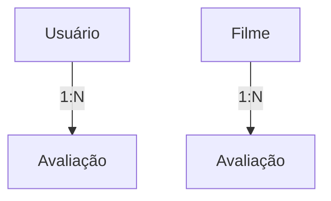

# 📱 API StoreManager


## 🚀 Visão Geral

A API do BetterBoxd é uma plataforma voltada para avaliação de filmes, inspirada no Letterboxd, oferecendo funcionalidades para registrar usuários, avaliar filmes, e interagir com a comunidade.

Construída com ASP.NET Core e C# 12, a aplicação possui uma arquitetura limpa, utilizando o Entity Framework Core para acesso a dados, seguindo os princípios SOLID de desenvolvimento e oferecendo uma documentação clara via Swagger.

## 🛠️ Tecnologias Utilizadas

- ASP.NET Core 3.1
- .NET 8
- C# 12
- Entity Framework Core
- SQL Server
- Swagger/OpenAPI

## ⚙️ Pré-requisitos

- Visual Studio 2022
- .NET SDK 8.0
- SQL Server
- Git

## 🔄 Fluxo de Funcionamento

O sistema segue uma lógica específica para o relacionamento entre entidades:



### 🎬 Fluxo de Criação de Avaliação

1. **Usuários** e **Filmes** são cadastrados separadamente por meio de suas respectivas rotas.

2. Para registrar uma **Avaliação**:
   - Envie uma requisição POST /api/avaliacoes informando o ID do usuário, o ID do filme, a nota atribuída, o comentário e a data da avaliação.
   - O sistema retorna um JSON com os dados da avaliação criada e o status HTTP `200 OK`.

3. **Filmes** são inicialmente cadastrados com uma **nota média igual a 0**. Essa nota é atualizada automaticamente com base nas avaliações associadas ao filme — seja na criação, edição ou exclusão de uma avaliação.

Esse fluxo garante que as informações sobre os filmes estejam sempre atualizadas de forma dinâmica, refletindo com precisão a média das avaliações feitas pelos usuários.

## 📚 Documentação da API

Acesse a documentação completa da API através do Swagger: `https://localhost:7066/swagger/`

### 📋 Endpoints Disponíveis

#### 👤 Usuários
| Método | Endpoint                | Descrição                                                   |
|--------|-------------------------|-------------------------------------------------------------|
| GET    | `/api/v1/users`          | Lista todos os usuários cadastrados                         |
| GET    | `/api/v1/users/{id}`     | Obtém um usuário específico pelo ID                          |
| POST   | `/api/v1/users`          | Cadastra um novo usuário                                    |
| PUT    | `/api/v1/users/{id}`     | Edita um usuário existente pelo ID                          |
| DELETE | `/api/v1/users/{id}`     | Remove um usuário pelo ID                                   |

#### 👤 Filmes
| Método | Endpoint                | Descrição                                                   |
|--------|-------------------------|-------------------------------------------------------------|
| GET    | `/api/v1/filmes`          | Lista todos os filmes cadastrados                         |
| GET    | `/api/v1/filmes/{id}`     | Obtém um filme específico pelo ID                          |
| GET | `/api/v1/filmes/diretor/{diretor}`     | Obtém uma lista de filmes pelo nome do diretor                                  |
| GET | `/api/v1/filmes/genero/{genero}`     | Obtém uma lista de filmes pelo nome do gênero                                   |
 GET | `/api/v1/filmes/ano/{ano}`     | Obtém uma lista de filmes pelo ano de lançamento                                  |
| POST   | `/api/v1/filmes`          | Cadastra um novo filmes                                    |
| PUT    | `/api/v1/filmes/{id}`     | Edita um filme existente pelo ID                          |
| DELETE | `/api/v1/filmes/{id}`     | Remove um filme pelo ID                                   |

### ⚠️ Possíveis Códigos de Resposta

- **200 OK**: Operação realizada com sucesso.
- **400 Bad Request**: Erro de validação de dados.
- **404 Not Found**: Recurso não encontrado (usuário, por exemplo).
- **500 Internal Server Error**: Erro no servidor.


## 💻 Instalação

```bash
# Clone o repositório
git clone https://github.com/VictorBrasileiroo/StoreManager-API.git

# Entre na pasta do projeto
cd StoreManager-API

# Restaure os pacotes
dotnet restore

# Atualize o banco de dados com as migrations
dotnet ef database update
```

## 📂 Estrutura do Projeto

```
├── StoreManager.API.sln/
│   ├── StoreManager.API/            # Projeto principal da API
│   │   ├── Controllers/             # Endpoints da API
│   │   ├── Data/                    # Contexto do Banco de dados
│   │   ├── DTOs/                    # Objetos de Transferência de Dados
│   │   ├── Migrations/              # Migrações para o Banco de Dados
│   │   ├── Models/                  # Modelos/Entidades
│   │   ├── Services/                # Serviços de negócio
│   │       ├── Interfaces/          # Interfaces
│           ├── Services/            # Métodos
│   │   └── Program.cs               # Ponto de entrada da aplicação
```

## ⚙️ Configuração

1. Atualize a string de conexão no arquivo `appsettings.json`:

```json
{
  "ConnectionStrings": {
    "DefaultConnection": "Server=seuServidor;Database=suaDatabase;User Id=seuUsuario;Password=suaSenha;"
  }
}
```

2. Configure quaisquer outros parâmetros necessários (chaves de API, configurações de autenticação, etc.)

## ▶️ Como Executar

### Usando Visual Studio 2022:
1. Abra a solução no Visual Studio 2022
2. Pressione F5 ou utilize o botão "Executar"

### Usando linha de comando:
```bash
cd src/StoreManager.API
dotnet run
```

A API estará disponível em: `https://localhost:7066/` (ou a porta configurada)

## 🤝 Contribuição
Sinta-se à vontade para sugerir melhorias e correções!

## 📄 Licença

Este projeto está licenciado sob a licença MIT - veja o arquivo LICENSE.md para detalhes.

## 📧 Contato

Victor André Lopes Brasileiro - valb1@ic.ufal.br

Link do Projeto: [https://github.com/VictorBrasileiroo/StoreManager-API](https://github.com/VictorBrasileiroo/StoreManager-API)
